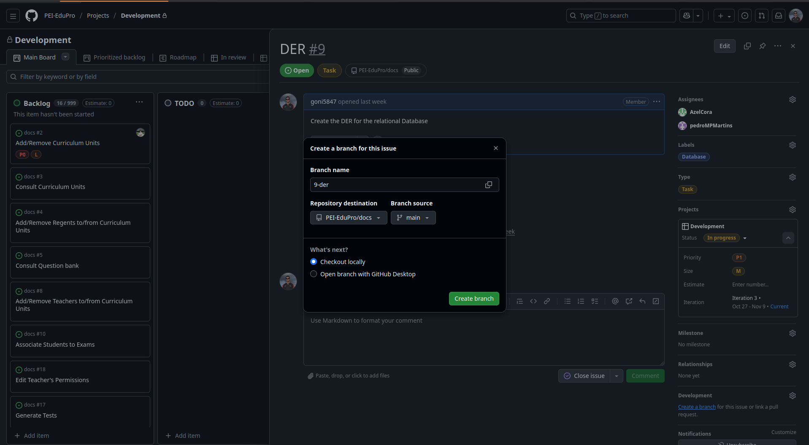

```
git checkout dev
git pull
git checkout -b <type>/branch_name>

---- implementar ----

git add .
git commit -m "<type>: <message>"
git push --set-upstream origin <type>/branch_name>

---- create MR -----

mudar para dev
preencher campos
create merge request
```


In github UI

Click on the issue


Select "create Branch" (small blue link bottom right of the screen)


Create branch
