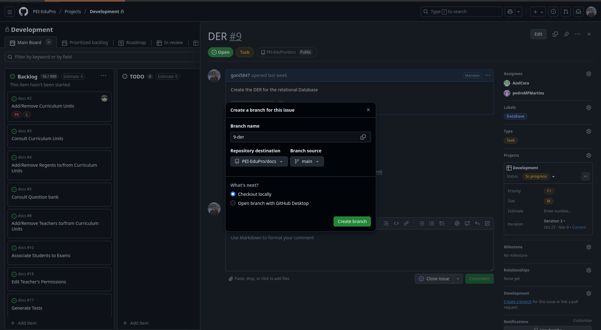

## Running the Project Locally

### First change directory to deployment
```bash
cd deployment
```

### Run Everything (Default)
```bash
sudo docker compose -f docker-compose.dev.yml up --build
```

### Run Specific Components

**Database only:**
```bash
sudo docker compose -f docker-compose.db.yml up
```

**Database + API:**
```bash
sudo docker compose -f docker-compose.db.yml -f docker-compose.api.yml up
```

**Database + Keycloak:**
```bash
sudo docker compose -f docker-compose.db.yml -f docker-compose.keycloak.yml up

# Down with
sudo docker compose down
```

**Everything except frontend:**
```bash
sudo docker compose -f docker-compose.db.yml -f docker-compose.keycloak.yml -f docker-compose.api.yml up

# Down with
sudo docker compose down
```

### Docker Compose Structure
- `docker-compose.dev.yml` - Main file (includes all components)
- `docker-compose.db.yml` - App database
- `docker-compose.keycloak.yml` - Keycloak + DB + config
- `docker-compose.api.yml` - Backend API
- `docker-compose.fe.yml` - Frontend


### API Documentation

**Development environment only** (API port exposed directly):
- Swagger UI: http://localhost:8000/docs
- ReDoc: http://localhost:8000/redoc


---

```
git checkout dev
git pull
git checkout -b <type>/branch_name>

---- implementar ----

git add .
git commit -m "<type>: <message>"
git push --set-upstream origin <type>/branch_name>

---- create MR -----

mudar para dev
preencher campos
create merge request
```


In github UI

Click on the issue


Select "create Branch" (small blue link bottom right of the screen)


Create branch
